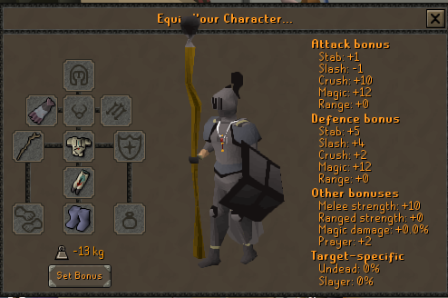

# Cosmetics Network
A plugin for setting up some cosmetic appearance for yourself that every other user with the plugin can see.

# Using the plugin
Once the plugin is enabled, it will query for the cosmetic overrides of other players and apply them as needed.

# Setting Your Overrides
Of course, the plugin would be more or less useless if you couldn't somehow set your own cosmetic overrides.
Unfortunately, verifying the owner of a RuneScape account from a third party source is difficult. To make matters
worse, many in the community feel it is important for cosmetic overrides only be settable to items an account
has already obtained. For these reasons, setting your overrides is a bit more convoluted than it probably
deserves to be.

First, equip all items you want to use as your cosmetic override.
Second, join the `RLCosmetics` Chat Channel. 
Next, find a ranked member of the Chat, such as TheArmy (who is usually alching or crafting at the GE), and find them in-game.
Once you find them, send the message `!cosmetics` in the _Chat Channel_. On their end, the plugin will save your cosmetics data,
and your overrides will become visible to everyone else using the plugin within five minutes. If you disable and re-enable the plugin
for yourself it should update almost instantly for you.

# Layout
Note that this repository is the branch for the plugin itself. The source code for the backend that stores the cosmetics of every player is hosted [here](https://github.com/JohnathonNow/rcn-backend).
